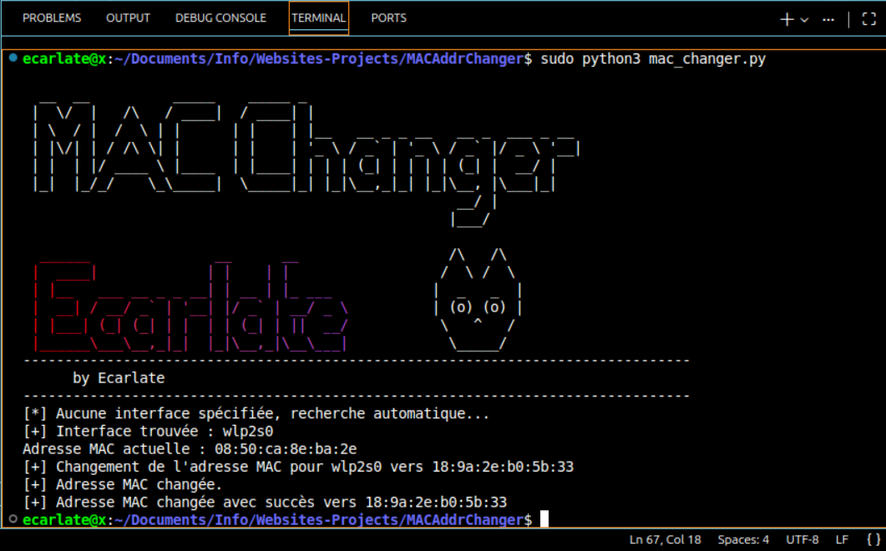

# Changeur d'Adresse MAC

Ce script en Python permet de changer l'adresse MAC d'une interface réseau spécifiée vers une adresse aléatoire.

## Prérequis

- Python 3
- Privilèges root (sudo)

## Utilisation

1.  Rendre le script exécutable (c'est optionnel) :
    ```bash
    chmod +x mac_changer.py
    ```

2.  Lancer le script (il détecte automatiquement l'interface) :
    ```bash
    sudo python3 mac_changer.py
    ```

3.  Ou spécifier l'interface manuellement (par exemple `eth0` ou `wlan0`) :
    ```bash
    sudo python3 mac_changer.py -i wlan0
    ```

## Mais comment trouver le nom de ton interface ???

Tu  peux lister tes interfaces réseau avec la commande :
```bash
ip link show
```
ou
```bash
ifconfig
```


## (Si tu veux) Convertir le script en application cliquable

Si tu veux lancer le script juste en cliquant sur son icône, voici comment (sous Linux) :

1.  Crée un fichier nommé `MacChanger.desktop` sur ton Bureau.
2.  Ouvre-le avec un éditeur de texte et colle ça dedans (vérifie que le chemin est bien le bon) :

```ini
[Desktop Entry]
Version=1.0
Name=MAC Changer Ecarlate
Comment=Change l'adresse MAC aléatoirement
Exec=gnome-terminal -- bash -c "sudo python3 /home/ecarlate/Documents/Info/Websites-Projects/MACAddrChanger/mac_changer.py; echo; echo 'Appuie sur Entrée pour quitter...'; read line"
Icon=utilities-terminal
Terminal=false
Type=Application
Categories=Utility;Application;
```

3.  Ensuite fais un clic droit sur le fichier -> **Propriétés** -> **Permissions** -> Coche **"Autoriser l'exécution du fichier comme un programme"**.

Maintenant, lorsque tu double-cliques dessus, un terminal s'ouvrira, te demandera ton MDP, changera l'adresse MAC, et tout est bien qui finit bien.
